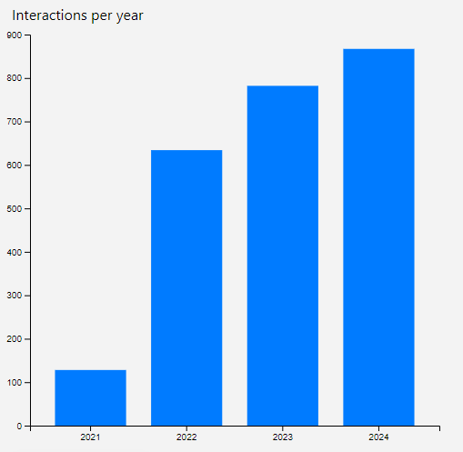
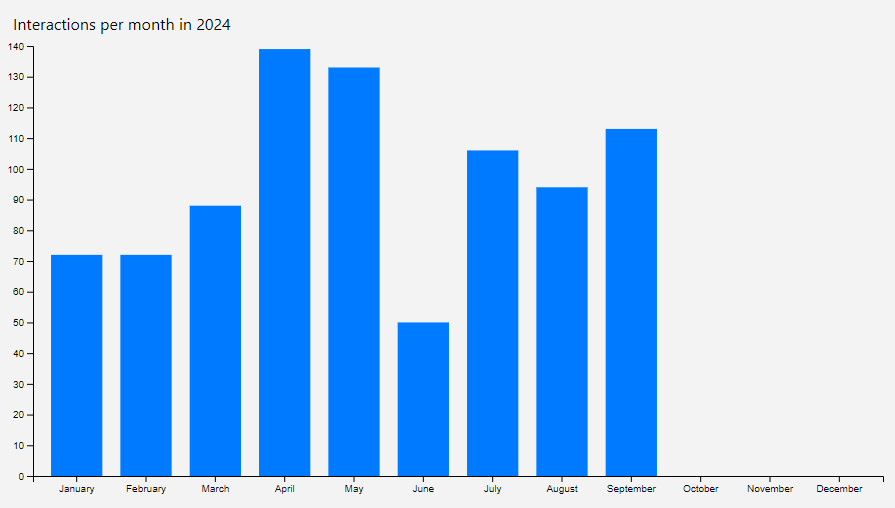

This is the user manual to use GitHub explorer.

# The Home page

When you visit the application, you'll be shown the Home page. In there, you can read about the application and what it has to offer.

# Sign in

If you aren't signed in yet, you can access the sign in page by clicking in the `Sign In` button in the navigation bar. This will redirect you to the log in page where you can access the GitHub OAuth login just by clicking the `Sign In with GitHub` button.

After that, you'll be redirected to your profile.

# The Profile page

In your profile page you'll see a resume with some basic information of your GitHub account data, like your user name and your profile page.

Right below that, you'll see two charts representing your GitHub interactions over different periods of time.

The `Interactions per year` chart shows your GitHub interactions per all the years you've been working with GitHub. It helps you know which years you were more active. E.g.:

The `Interactions per month in <year>` chart shows your GitHub interactions per month during the current year. It helps you know what months you are more active in GitHub. E.g.:

All this information is obtained via a wrapper of the GitHub API by `grubersjoe` at [grubersjoe/github-contributions-api](https://github.com/grubersjoe/github-contributions-api).

# The Explore page

The explore page is accessible by clicking the `Explore` button in the navigation bar.

Once in the page, you'll see a lot of data from _repository of the day_. The repository of the day is a random wide-used repository that changes every day.

In the first section, you'll see **all** the published releases for the repository of the day. For every release, you'll see a card with their title, a link to their release page, their tag, their description (clamped to a max of 6 lines with an option to `Read more` if needed), a link to download the release and some tags to determine if it's a pre-release or a draft.

In their second section, you'll see **all** the GitHub issues of the repository of the day, including open and closed issues. For every issue, you'll see a card with their title, summary (again, clamped to a max of 6 lines with an option to `Read more` if needed), the author (with a link to its profile) and a tag to see if they're closed or not.

All this information is obtained via the GitHub API: [issues](https://docs.github.com/es/rest/issues/issues?apiVersion=2022-11-28#list-repository-issues) and [releases](https://docs.github.com/es/rest/releases/releases).

**Note**: You'll notice that the page takes some time to load. This is completely normal as it loads tons of data.

**Note for devs**: This information isn't paginated because I wanted to test how the pre-fetching facility worked and how Next.js can handle long API queries in its server components.

# The themes

This application supports light and dark theme. You can alternate them by clicking the top right icon in the navigation bar.
